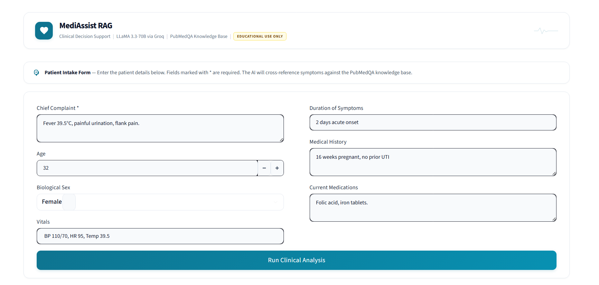
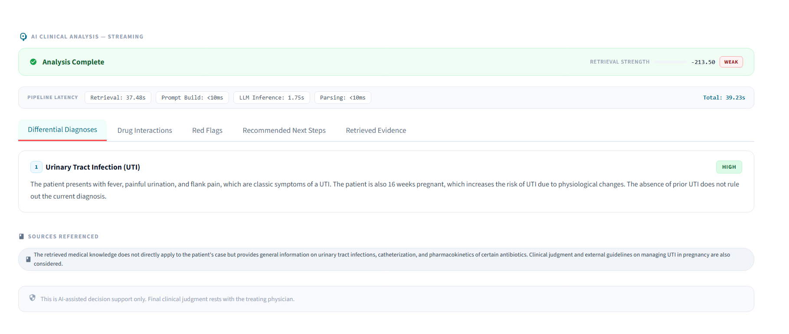

# 🏥 MediAssist RAG — Clinical Decision Support System

A **Retrieval-Augmented Generation (RAG)** system that helps doctors analyze patient symptoms and receive AI-generated clinical insights. It combines a **BioBERT** medical embedding model, a **ChromaDB** vector database indexed with PubMed research, and **LLaMA 3.3-70B** via Groq to produce structured, evidence-backed clinical assessments in real time.

> ⚠️ **Disclaimer:** This tool is for educational and demo purposes only. Final clinical judgment always rests with the treating physician.

---




## 🧠 How It Works

```
Doctor fills patient form
        ↓
Chief complaint → BioBERT embedding
        ↓
ChromaDB vector search → top 8 PubMed chunks
        ↓
Re-ranked by similarity score → top 4 chunks
        ↓
Structured clinical prompt built
        ↓
LLaMA 3.3-70B (Groq API, streamed)
        ↓
JSON response: Diagnoses · Drug Interactions · Next Steps
```

---

## ✨ Features

- 🔬 **Evidence-based answers** — grounded in ~1,000 labeled PubMedQA abstracts
- ⚡ **Streaming output** — token-by-token response as the LLM generates
- 🧬 **Medical embeddings** — BioBERT fine-tuned on clinical NLI tasks
- 📊 **Structured JSON output** — top diagnoses with confidence levels, drug interactions, red flags, and recommended next steps
- 🖥️ **Clean Streamlit UI** — two-column patient form, tabbed results view

---

## 📁 Project Structure

```
mediassist-rag/
├── app/
│   └── main.py              # Streamlit UI — patient form + results display
├── pipeline/
│   ├── embedder.py          # BioBERT embedding model (lazy-loaded)
│   ├── retriever.py         # ChromaDB vector search + re-ranking
│   └── prompt_builder.py    # Builds the structured clinical prompt
├── inference/
│   └── llm_client.py        # Groq API client (streaming)
├── scripts/
│   └── build_index.py       # One-time script: index PubMedQA into ChromaDB
├── data/
│   └── chroma_db/           # Persistent ChromaDB vector store
├── config.yaml              # Central configuration (models, chunking, top-k)
├── .env                     # API keys (never commit — see .gitignore)
├── .env.example             # Safe template for environment variables
├── requirements.txt         # Pinned Python dependencies
└── .gitignore
```

---

## ⚙️ Configuration (`config.yaml`)

| Key | Value | Description |
|---|---|---|
| `embedding_model` | `pritamdeka/BioBERT-...` | Medical sentence embedding model |
| `vector_top_k` | `8` | Candidates fetched from ChromaDB |
| `rerank_top_k` | `4` | Top chunks kept after re-ranking |
| `chunk_size` | `512` | Token size per indexed chunk |
| `chunk_overlap` | `50` | Overlap between adjacent chunks |
| `max_tokens_output` | `1024` | Max LLM response tokens |
| `temperature` | `0.1` | Low temperature for factual, deterministic output |
| `chroma_path` | `./data/chroma_db` | Vector DB storage location |
| `collection_name` | `medical_knowledge` | ChromaDB collection name |

---

## 🚀 Setup Guide

### Prerequisites

- Python **3.10+**
- A free **[Groq API key](https://console.groq.com/)** (for LLaMA 3.3-70B access)

---

### Step 1 — Clone the Repository

```bash
git clone https://github.com/your-username/mediassist-rag.git
cd mediassist-rag
```

---

### Step 2 — Create & Activate a Virtual Environment

```bash
# Windows
python -m venv venv
.\venv\Scripts\activate

# macOS / Linux
python -m venv venv
source venv/bin/activate
```

---

### Step 3 — Install Dependencies

```bash
pip install -r requirements.txt
```

---

### Step 4 — Configure Environment Variables

Copy the example env file and fill in your Groq API key:

```bash
# Windows
copy .env.example .env

# macOS / Linux
cp .env.example .env
```

Edit `.env`:

```ini
GROQ_API_KEY=your_groq_api_key_here
MODEL_NAME=llama-3.3-70b-versatile
```

Get your free Groq API key at → **[console.groq.com](https://console.groq.com/)**

---

### Step 5 — Build the Knowledge Index

This downloads the **PubMedQA** dataset from HuggingFace and indexes ~1,000 labeled medical Q&A entries into ChromaDB. **Run this once** before launching the app.

```bash
python scripts/build_index.py
```

> 📥 This will download the BioBERT model (~400 MB) and the PubMedQA dataset on first run. Subsequent runs are fast since both are cached locally.

---

### Step 6 — Launch the App

```bash
streamlit run app/main.py
```

Open your browser at **[http://localhost:8501](http://localhost:8501)**

---

## 🩺 Using the App

1. Fill in the patient form:
   - **Chief Complaint** *(required)* — e.g., `Chest pain for 2 days, radiating to left arm`
   - **Age / Sex / Vitals / Duration**
   - **Medical History** — existing conditions
   - **Current Medications** — for drug interaction checks

2. Click **🔍 Analyze Patient**

3. The AI streams its response and displays:
   | Tab | Content |
   |---|---|
   | **Diagnoses** | Top differential diagnoses with confidence (High/Medium/Low) and clinical reasoning |
   | **Drug Interactions** | Potential interactions with listed medications |
   | **Next Steps** | Recommended investigations, referrals, or treatments |

---

## 🧰 Tech Stack

| Component | Technology |
|---|---|
| UI | [Streamlit](https://streamlit.io/) |
| Embedding Model | [BioBERT (pritamdeka)](https://huggingface.co/pritamdeka/BioBERT-mnli-snli-scinli-scitail-mednli-stsb) via `sentence-transformers` |
| Vector Database | [ChromaDB](https://www.trychroma.com/) (persistent, local) |
| Knowledge Base | [PubMedQA](https://huggingface.co/datasets/qiaojin/PubMedQA) (pqa_labeled, ~1k documents) |
| LLM | `llama-3.3-70b-versatile` via [Groq](https://groq.com/) |

---

## 📋 Requirements

```
chromadb==1.5.2
datasets==4.6.1
groq==1.0.0
python-dotenv==1.2.1
PyYAML==6.0.3
sentence-transformers==5.2.3
streamlit==1.54.0
tqdm==4.67.3
```

---

## 🔒 Security Notes

- **Never commit `.env`** — it is listed in `.gitignore`
- Use `.env.example` as a safe reference for required variables
- Rotate your Groq API key immediately if it is accidentally exposed

---

## 📄 License

This project is for educational and research use only. Not intended for real clinical deployment.
